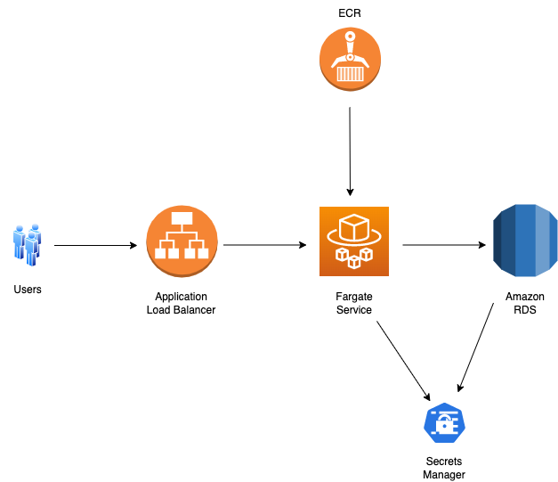

# TechChallengeApp

This project is in response to the Servian tech challenge app used for challenging candidates applying to work with Servian.

## Deployment Pre-requisites

* [AWS CLI](https://docs.aws.amazon.com/cli/latest/userguide/getting-started-install.html)
* AWS Account and User
Note: For production deployment, it's recommended to customise the IAM policy so the user won't have more permissions than it's required. Due to the time reasons, please use create a user in Administrators group. Instructions can be referenced [here](https://docs.aws.amazon.com/cli/latest/userguide/getting-started-prereqs.html)
* [Node.js](https://nodejs.org/en/)
* AWS CDK Toolkit

```
npm install -g aws-cdk
npm install -g typescript@latest
```

## Deployment Steps

1. Clone the git repo

```
git clone https://github.com/cheeham51/servian-tech-challenge.git 
```

2. Navigate to the infra folder

```
cd servian-tech-challenge/infra
```

3. Install dependencies

```
npm install
```

4. Build it

```
npm run build
```

5. Deploy it

```
cdk context --clear (Make sure run this command in case CDK picks up previous cache and fails to deploy)

cdk deploy --require-approval never
```

## Application Architecture


 
## Project Directory

```
.
    ├── TechChallengeApp                       # Servian tech challenge app
    ├── infra                                  # Contains CDK app for infrastructure
    │   ├── bin/infra.ts                       # Entrypoint of the CDK application
    │   ├── lib/infra-stack.ts                 # Define the infra stack (main stack)
    │   ├── lib/resource-initializer.ts        # Define the custom resource to initialise database
    │   ├── lambda                             # Contains the custom resource Lambda docker image
    │   └── ...                                # Other files
    └── README.md
```