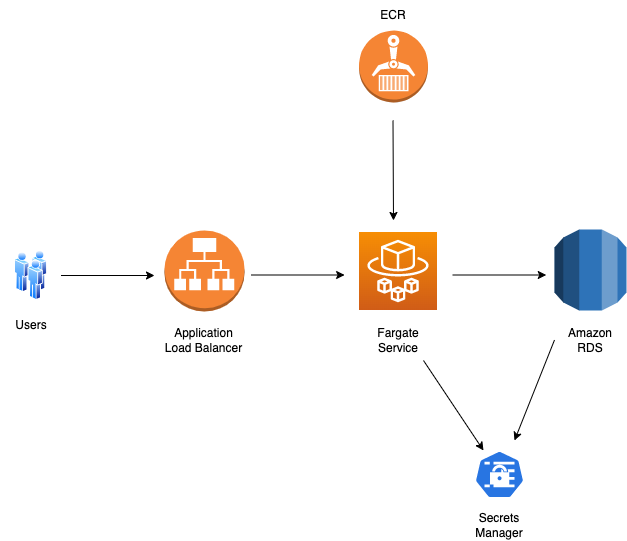

# TechChallengeApp

This project is in response to the Servian tech challenge app used for challenging candidates applying to work with Servian.

## Application Architecture


 
## Project Directory

```
.
    ├── TechChallengeApp                       # Servian tech challenge app
    ├── infra                                  # Contains CDK app for infrastructure
    │   ├── bin/infra.ts                       # Entrypoint of the CDK application
    │   ├── lib/infra-stack.ts                 # Define the infra stack (main stack)
    │   ├── lib/resource-initializer.ts        # Define the custom resource to initialise database
    │   ├── lambda                             # Contains the custom resource Lambda docker image
    │   └── ...                                # Other files
    └── images                                 # Contains images for README file
    └── README.md
```

## Deployment Pre-requisites

* [AWS CLI](https://docs.aws.amazon.com/cli/latest/userguide/getting-started-install.html)
* AWS Account and User\ \
Note: For production deployment, it's recommended to customise the IAM policy so the user won't have more permissions than it's required. Due to the time reasons, please use create a user in Administrators group. Instructions can be referenced [here](https://docs.aws.amazon.com/cli/latest/userguide/getting-started-prereqs.html)
* [Node.js](https://nodejs.org/en/)
* AWS CDK Toolkit
  \ \
  npm install -g aws-cdk \
  npm install -g typescript@latest

## Deployment Steps

1. Clone the git repo

```
git clone https://github.com/cheeham51/servian-tech-challenge.git 
```

2. Navigate to the infra folder

```
cd servian-tech-challenge/infra
```

3. Install dependencies

```
npm install
```

4. Build it

```
npm run build
```

5. Deploy it

```
cdk deploy \
or \
cdk deploy --require-approval never (if you want to skip the "Do you wish to deploy these changes (y/n)" check)
```

## Deployed Application URL

The URL of the deployed app is in the Cloudformation stack output.


## Database setup

The database is RDS provisioned in a private subnet within the VPC. To reduce the deployment time, only one RDS instance is created. In a production environment, it's recommended to create a RDS cluster with a replica to achieve high availability and fault tolerance. \ \

./TechChallengeApp updatedb command doesn't work on RDS according to [issue 29](https://github.com/servian/TechChallengeApp/issues/29). Able to replicate the issue during my testing. To make it work, a Lambda-backed custom resource is implemented to initialise the database and perform the data seeding. \ \

A logic has been added to the custom resource Lambda function to ignore UPDATE and DELETE event, so seeding data will only be performed when the stack is initially created. Therefore future updates on the stack won't accidentally reset the database.

## Security Considerations

Database credentials are managed by the AWS Secrets Manager to avoid hard-coding the password. The credentials are passed to the Fargate service as environment variables. However to harden the security further, we can add logics in the app to retrieve the credentials directly from the Secrets Manager without having to have environment variables in the middle.

## Clean Up

```
cdk destroy